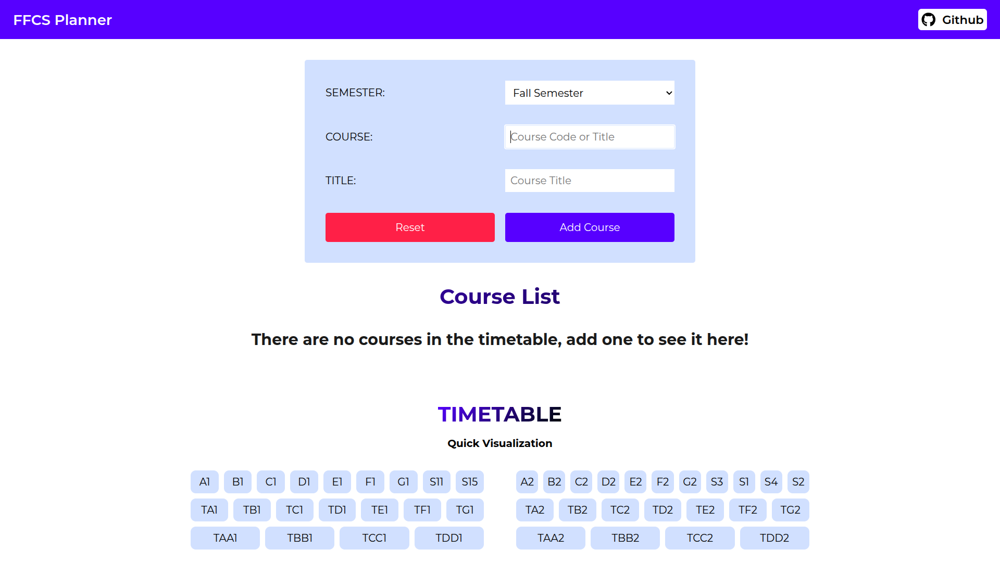
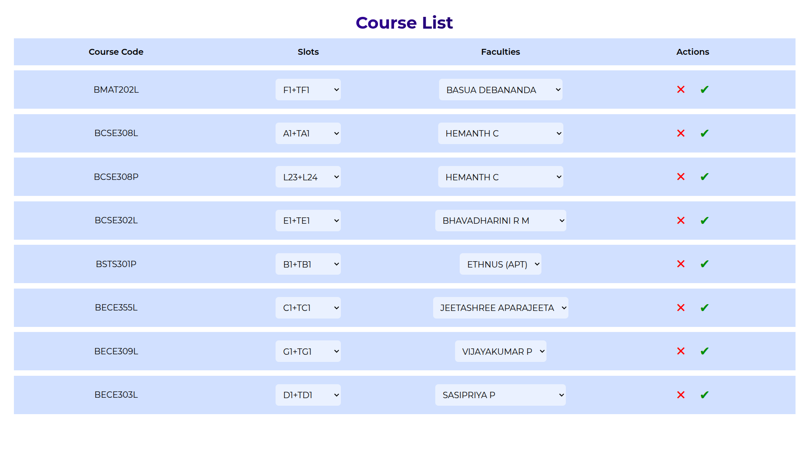
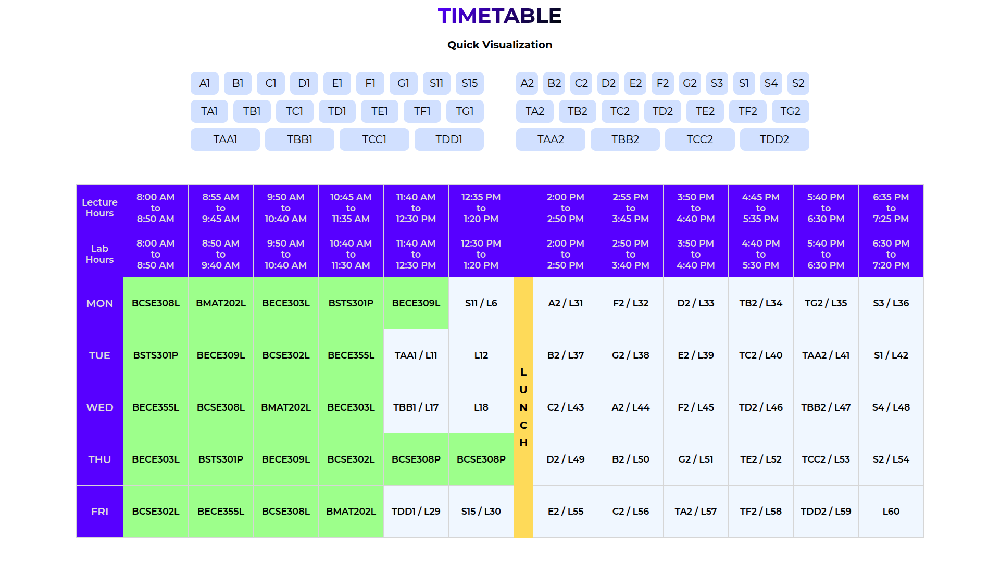
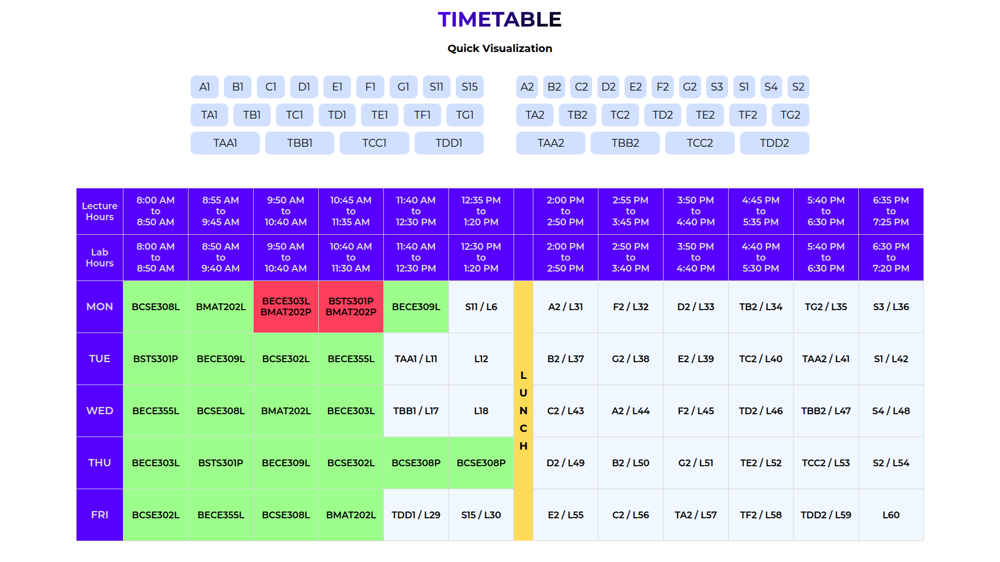

# 📅 FFCS VIT Timetable Planner

A sleek and efficient planner to help VIT students build their **FFCS** timetable with ease.

---

## ✨ Features

- 📌 Select courses and visualize your weekly schedule
- 🧠 Conflict detection
- 💡 Clean UI for easy course management
- 💾 Save and load timetable drafts

---

## 📸 Screenshots

**Add Courses**

**Course List**

**Timetable View**

**Clash Indication**

---

## 🛠️ Technologies Used

- HTML
- CSS
- JavaScript
- React

---

## 🙋‍♂️ How It Works

1. Choose the course code by searching the code/title.
2. Add the course to the course list.
3. Select the desired slot, faculty and save the entry.
4. View and export your final timetable.

---

## 📄 License

This project is licensed under the MIT License — see the [LICENSE](LICENSE) file for details.

---
